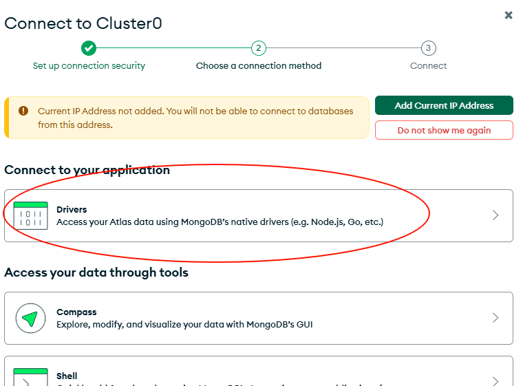

# Connexió amb Bases de Dades Reals

## Atlas MongoDB - La Base de Dades per a la nostra aplicació

MongoDB Atlas és un servei de base de dades gestionat per MongoDB. Aquest servei permet crear clústers de bases de dades MongoDB en la núvol de forma ràpida i senzilla.

### Crear un cluster en MongoDB Atlas

1. Per poder crear un clúster en MongoDB Atlas, primer cal tenir un compte a MongoDB Atlas. Per crear un compte, accedeix a la pàgina web de [MongoDB Atlas](https://www.mongodb.com/cloud/atlas) i segueix els passos per crear un compte.
2. Teniu informació addicional sobre com fer servir aquesta aplicació a [MongoDB - Atlas Tutorial](https://www.mongodb.com/resources/products/platform/mongodb-atlas-tutorial)
3. Un cop creat el compte, accedeix a la consola de MongoDB Atlas.
4. A la consola, clica a l'opció "Create a Cluster". Et donarà opció a crear-ne un de gratuït. 
5. Segueix els passos per crear el clúster. 
6. Quan entris a Atlas, hauràs de dir-li que accepti la connexió des de la IP que estàs fent servir.

### Afegint Prisma a la nostra aplicació

[Prisma](https://www.prisma.io/) és una eina que ens permet interactuar amb bases de dades de forma senzilla i eficient. Per afegir Prisma a la nostra aplicació, cal seguir els següents passos:

1. Pots mirar la documentació de Prisma a [Prisma Quick Start](https://www.prisma.io/docs/getting-started/quickstart-sqlite) si ho consideres.
2. Comencem instal·lant prisma tal com ens diuen (nosaltres ja tenim el projecte creat): `npm install prisma --save-dev`
3. I ara inicialitzem Prisma perquè funcioni amb mongoDB: `npx prisma init --datasource-provider mongodb`
4. Això us hauria de crear una nova carpeta anomenada `prisma` amb un fitxer `schema.prisma` a dins. Aquest fitxer és on definirem el nostre model de dades.

Ara torna a MongoDB Atlas i selecciona per connectar-te al teu cluster. On veus que posa "Connect to your application" selecciona "Drivers" com a la següent imatge: 



Segueix les instruccions (instal·lar el driver de MongoDB) i copia la cadena de connexió que et donen. Ara ves al fitxer `.env` que també ha aparegut a la carpeta del teu projecte i afegeix la cadena de connexió com a valor de la variable `DATABASE_URL`.

Després de la barra ('/') abans dels query parameters, pots afegir el nom de la base de dades que vulguis crear, per exemple `remix-expenses`. T'hauria de quedar quelcom així:

```js
DATABASE_URL="mongodb+srv://<username>:<password>@<cluster>/<database>?retryWrites=true&w=majority"
```
Aquesta direcció serà la que en faci ús `schema.prisma` per connectar-se a la base de dades.

## Afegint un model de dades a Prisma

No és l'objectiu però pots afegir l'extensió de Prisma a Visual Studio Code perquè et doni suport a l'hora de treballar amb el fitxer `schema.prisma`. Per fer-ho, segueix aquests passos:

Modifica el fitxer `schema.prisma` perquè contingui el següent:

```prisma
// This is your Prisma schema file,
// learn more about it in the docs: https://pris.ly/d/prisma-schema

// Looking for ways to speed up your queries, or scale easily with your serverless or edge functions?
// Try Prisma Accelerate: https://pris.ly/cli/accelerate-init

generator client {
  provider = "prisma-client-js"
}

datasource db {
  provider = "mongodb"
  url      = env("DATABASE_URL")
}

/// El model `Expense` representa un registre de despesa a la base de dades.
/// 
/// Camps:
/// - `id`: Un identificador únic per a la despesa, generat automàticament. Mapat a la columna de la base de dades `_id`.
/// - `title`: El títol de la despesa.
/// - `amount`: La quantitat de diners gastats, emmagatzemada com un número de punt flotant.
/// - `date`: La data de la despesa.
/// - `dateAdded`: La marca de temps quan es va afegir la despesa, establerta automàticament a la data i hora actual.
model Expense {
  id  String   @id @default(auto()) @map("_id") @db.ObjectId
  title String 
  amount Float
  date DateTime
  dateAdded   DateTime @default(now())
}

// id és una mica especial. Ha de contenir:
// - @id: Indica que aquest camp és l'identificador únic del model.
// - @default(auto()): Indica que el valor d'aquest camp s'ha de generar automàticament.
// - @map("_id"): Indica que aquest camp s'ha de mapejar a la columna "_id" de la base de dades.
// - @db.ObjectId: Indica que aquest camp ha de ser un ObjectId de MongoDB.
```
Com veus els camps `id` i `dateAdded` són especials. Aquests s'afegiran per defecte sense necessitat de passar-los nosaltres. 

I ara genera el client de Prisma amb la comanda `npx prisma generate`. Això afegirà a `node_modules` el client de Prisma.


## Preparant el codi per enviar les meves dades

Abans de començar, super IMPORTANT!

Les 'Actions' i 'Loaders' les afegirem a les nostres rutes, no als nostres components. Sòn les rutes les que s'han d'encarregar de gestionar la lògica de la nostra app i els components s'han de limitar a mostrar la informació que els passen.

### Afegint "Action" de l'Expense Form

L'expense form es fa servir a més d'un lloc de la nostra aplicació. De moment implementem-ho a `add` i afegimr l'acció per poder enviar les dades a la base de dades.

Recorda que les `Actions` es recolliran qualssevol petició del tipus POST, PUT, DELETE, etc. que hi hagi sota el seu domini (ruta). Així que en aquest cas, com que estem afegint una nova despesa i el nostre formulari és de tipus POST, aquesta serà l'encarregada de rebre la petició.

> **Nota:** Crea una carpeta anomenada `data` al teu projecte i copia el fitxer `database.server.ts` que trobaràs al codi de referència. Ho necessitarem per poder connectar-nos a la base de dades. Per cert, si fem servir el nom de fitxer `server.js` remix sap que aquest codi només s'ha de fer servir al servidor i no al client.

De moment afegeig l'acció a la pàgina `add` sense cap lògica a dins. Això ho farem més endavant.

```js
... 
export async function action(args: ActionFunctionArgs) {
  return {};
}
```
Ara torna a crear un nou arxiu a la carpeta `data` anomenat `expenses.server.tsx` i afegim el codi que, junt amb Prisma, ens permet enviar les dades a la base de dades.

```tsx
// data/expenses.server.ts
import { Expense } from "../types/interfaces";
import { prisma } from "./database.server";

export async function addExpense(expenseData: Expense) {
  console.log("Adding expense:", expenseData);
  try {
    await prisma.expense.create({
      data: {
        title: expenseData.title,
        // L'operador + permet de convertir une string en number que és el que espera la BD
        amount: +expenseData.amount,
        // new Date(expenseData.date) permet de convertir la string en date que és el que espera la BD
        date: new Date(expenseData.date),
      },
    });
  } catch (error) {
    console.error("Error adding expense:", error);
    throw error;
  }
}
```
La funció `addExpense` serà el nostre "fetch POST" gestionat per Prisma que enviarà les dades a la base de dades. 

Ara sí que podem completar l'acció de la pàgina `add` amb la lògica per enviar les dades a la base de dades.

```tsx
// routes/_app/expenses.add.tsx

export async function action({ request }: ActionFunctionArgs) {
  // formData retorna la promesa de retornar la informació del formulari
  const formData = await request.formData();
  // Puc recuperar individualment els valors del formulari amb get() i el nom del camp
  // const title = formData.get("title");
  // const amount = formData.get("amount");
  // ...
  const expenseData = {
    title: formData.get("title") as string, // hauria de ser un string sempre i ens evita error TS
    amount: parseFloat(formData.get("amount") as string), // Converteix a número
    date: new Date(formData.get("date") as string), // Converteix a Data
  };

  console.log(formData, expenseData);
  await addExpense(expenseData);

  // És habitual retornar un redirect després d'una mutació.
  return redirect("/expenses");
}
```

És important que les dades siguin del tipus correcte abans d'enviar-les a la base de dades. Per exemple, el camp `amount` ha de ser un número i el camp `date` ha de ser una data. Si no ho fem, la base de dades ens retornarà un error.

## Alternativa - SupaBase (SQL)

També m'agradaria que provessim a connectar-nos amb una altra plataforma, [Supabase](https://supabase.com/). Aquesta plataforma ens permet connectar-nos a una base de dades PostgreSQL.

Per treballar de manera més senzilla, també és aconsellable fer ús del seu client. 

1. Instal·la el client de Supabase al projecte

```bash
npm install @supabase/supabase-js
```
2. Crear un fitxer per inicialitzar el client. Crea una carpeta 'utils' i un fitxer 'supabaseCient.ts' amb el següent codi:

```ts
// /app/utils/supabaseClient.ts
import { createClient, SupabaseClient } from "@supabase/supabase-js";

const supabaseUrl: string = "https://vsyidbwwlamucmzjqpca.supabase.co";
const supabaseKey: string | undefined = process.env.SUPABASE_KEY;

if (!supabaseKey) {
  throw new Error("Missing SUPABASE_KEY environment variable");
}

const supabase: SupabaseClient = createClient(supabaseUrl, supabaseKey);

export default supabase;
```
Al fitxer `.env` afegeix la variable d'entorn `SUPABASE_KEY` amb la clau que et donarà Supabase.

3. Ara a `expenses.server.ts` canvia el codi de Prisma per aquest:

```tsx
import supabase from "../utils/supabaseClient";
import { Expense } from "../types/interfaces";

export async function addExpense(expenseData: Expense) {
  const { data, error } = await supabase.from("expenses").insert([
    {
      title: expenseData.title,
      amount: +expenseData.amount,
      date: new Date(expenseData.date).toISOString(),
    },
  ]);

  if (error) {
    console.error("Error adding expense:", error);
    throw new Error(error.message);
  }

  return data;
}
```

Si proves a afegir una despesa, veuràs que ara les dades s'envien a la base de dades de Supabase.

# Afegint Validació del Servidor

A hores d'ara tenim una certa validació a través del nostre formulari. Però això no és suficient. La validació al client és preventiva i poc robusta ja que es pot canviar molt fàcilment modificant simplement a través del DevTools per exemple. 

Anem a validar les nostres dades a través d'un nou arxiu sota `/data` que anomenarem `validation.server.js`. Pots agafar l'arxiu que hi ha al repositori de referència i copiar-lo directament. 

Veuràs que hi ha una sèrie de validacions prou bàsiques que s'agafen totes elles en una funció que finalment retorna un objecte amb aquelles que no s'hagin validat, si s'escau. 

Ara afegeix aquesta validació a la teva ruta `_app.expenses.add`:

```tsx
...
  try {
    // Validem les dades abans de fer la mutació
    validateExpenseInput(expenseData);
  } catch (error) {
    // En aquest cas ens volem assegurar que l'usuari vegi els errors que han provocat aquest error de validació
    return error;
  }

  await addExpense(expenseData);
  return redirect("/expenses");
  ...
```

Com pots veure hi afegim una lògica de `try/catch` per poder gestionar l'error i fer-lo visible a l'usuari enlloc de retornar el `redirect` directament.

Això ens permet que al nostre component `ExpenseForm` puguem, amb `useActionData()`, recuperar les dades de l'erro. 

> **Nota:** Recorda que pots fer servir `useActionData()` a qualsevol component que estigui sota la ruta que ha generat l'acció, no únicament allà on gestiones `action`.  

```tsx
// components/ExpenseForm.tsx
//...
interface ValidationErrors {
  [key: string]: string; // Clau string i valor string
}
//...
  const validationErrors = useActionData<ValidationErrors>();
//...
 {validationErrors && (
        <ul className="mb-4 list-inside list-disc text-red-500">
          {Object.values(validationErrors).map((error: string) => (
            <li key={error}>{error}</li>
          ))}
        </ul>
      )}
//...
```

Si proves a treure la validació `min` del codi del return i tot i així intentes enviar-ho amb un valor negatiu, t'hauria d'aparèixer la informació d'error per l'usuari. 

Ens faltarà encara evitar que recarregui la pàgina. Això ho fa perquè en realitat estem tornant a enviar el form i per tant fa un POST que recull el loader. Ho veurem més endavant. 

## Enviament programàtic dels Forms

Abans de continuar hi ha quelcom rellevant a destacar. Pot haver-hi diferents motius pels quals ens pot interessar realitzar algunes tasques abans que el nostre form s'enviï, és a dir s'executi la petició POST. Fins ara hem vist que ens va molt bé automatitzar aquest procés i donar per fet que els `Action` s'encarregaran d'això sense necessitat de fer un submit.

Hi ha casos on el comportament per defecte d'un "submit" no és el que volem d'entrada. Per exemple, si volem que l'enviament es realitzi després d'algun "timer" o si volem fer alguna tasca abans de l'enviament, com per exemple netejar els camps del formulari.

Remix ens permet fer-ho a través de `useSubmit`, com s'ha fet de manera habitual als formularis de sempre.

```tsx
// components/ExpenseForm.tsx
//...
  const submit = useSubmit();

  function submitHandler(event) {
    event.preventDefault();
    // Fer la teva propia validació per exemple.
    //...
    submit(event.target, {
      // action: "/expenses/add", // Això no cal perquè ja ho fa el formulari
      method: "post",
    });
  }
  //...
  <form
      method="post"
      className="flex flex-col rounded-lg bg-gray-100 p-6 shadow-md"
      id="expense-form"
      onSubmit={submitHandler}
    >
  //...
```

