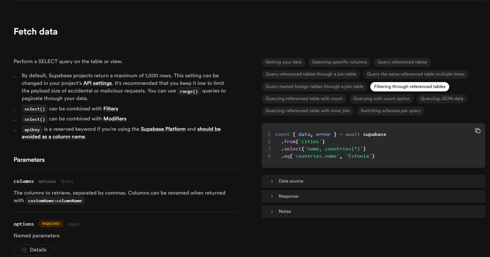

## Feedback quan enviem les dades

Abans de posar-nos amb la part de `Loader` anem a veure com millorar un comportament que tenim ara mateix. Un cop ha funcionat la crida a l'API i que hem guardat les dades a la nostra base de dades, hauríem de donar algun retorn, algun feedback a l'usuari que ha fet la crida.

Per fer-ho comencem canviant el `form` d'html pel `Form`de Remix. Recora que amb aquest `Form` ens quedem en el mateix component i no fem un refresh de la pàgina (Single Page) i la lògica es processa en el rerefons. 

El `Form` ens permetrà entre d'altres coses, donar feedback mentre la crida i càrrega de dades a l'API té lloc. Per fer-ho necessitem el hook `useNavigation` de Remix. Aquest hook ens permetrà navegar a una altra ruta de la nostra aplicació.

Com ja vam veure, aquest conté informació com l'estat de la crida. Això ho podem aprofitar per mostrar donar a l'usuari una millor experiència d'usuari:

```tsx
// ExpensesForm.tsx
//...
const ExpenseForm: React.FC = () => {
  const today = new Date().toISOString().slice(0, 10); // yields something like 2023-09-10

  // Hem d'assegurar a TS que validationErrors és un objecte amb claus string i valors string
  const validationErrors = useActionData<ValidationErrors>();

  const navigation = useNavigation();
  // si no està en estat idle, vol dir que està enviant dades
  const isSubmitting = navigation.state !== "idle";
  //...
    <button
          type="submit"
          disabled={isSubmitting}
          className="rounded-md bg-indigo-500 px-4 py-2 text-white hover:bg-indigo-600 focus:outline-none focus:ring-2 focus:ring-indigo-500"
        >
          {isSubmitting ? "Saving..." : "Submit"}
    </button>
  //...
}
```


# Fetching Expenses - Loader

Recordeu que fins ara estem fent servir unes dades de prova i que les carreguem directament des de `_app.expenses.tsx`.

```tsx
const DUMMY_EXPENSES = [
  {
    id: "e1",
    title: "First Expense",
    amount: 12.99,
    date: new Date().toISOString(),
  },
  {
    id: "e2",
    title: "Second Expense",
    amount: 16.99,
    date: new Date().toISOString(),
  },
];
```

Això sabem que ho hauríem de fer amb el `loader` de Remix. Recorda que Remix li passarà algunes dades al loader com ara `request` (amb alguns detalls sobre la petició) o `params` (si volem paràmetres de l'url). Però no és cap dels cassos en aquest cas.

Aquí el que necessitem és simplement recuperar i carregar les dades que ens retorna l'API. Per fer-ho, el primer que necessitem és implementar la funció de `get` al nostre `expenses.server.ts`. Recorda que estem treballant amb `supaBase` i que el client ens facilita una mica la vida:

```tsx
// expenses.server.ts
//...
// GET Expenses
export async function getExpenses(): Promise<Expense[]> {
  const { data, error } = await supabase
    .from("expenses")
    .select("*")
    .order("date", { ascending: true });

  if (error) {
    console.error("Error getting expenses:", error);
    throw new Error("Failed to get expenses.");
  }

  return data as Expense[]; // Garantim que `data` és una llista d'`Expense`
}

```
Ara app hauré d'importar aquesta funció i cridar-la des del `loader`:

```tsx
export async function loader() {
  return await getExpenses();
}
```
I ara farem servir `useLoaderData` per recuperar les dades al nostre component. Recorda novament, que no necessàriament s'ha de fer ús a la ruta on es troba el `loader`, tot i que en aquest cas sí serà així. 

Dins de la funció ExpensesLayout() farem servir `useLoaderData` per recuperar les dades:

```tsx
// compte, he importat Expense per tipar les dades. 
  const expenses = useLoaderData() as Expense[];
  //...
    <ExpensesList expenses={expenses} />
  //...
```
Les dades que es recuperen de la base de dades es "serialitzen". És a dir, son valors simples com `strings` o `numbers`. Per tant, si tenim dates, com en aquest cas, les hem de convertir a `Date`. S'ha de tenir en compte quan manipulem les dades. 
 
Ja hauries de poder veure les dades recuperades de la base de dades.

### Més sobre Loaders

Hem de saber algunes coses més sobre com Remix gestiona els loaders i les respostes.

El loader quan retorna les dades en realitat el que fa és retornar un Response.json(). És a dir:

```tsx
export async function loader() {
  return getExpenses();
}
```

És el mateix que:

```tsx
export async function loader() {

const expenses = await getExpenses();
return Response.json(expenses);
}
```

El `Loader` HA DE (MUST) retornar una `Response`. I el `Loader` sempre serà executat al servidor.

Anem a insistir en alguns temes claus del `Loader`:	

A Remix, el `loader` és una funció clau per gestionar dades que es poden renderitzar al servidor o al client, depenent del context de la teva aplicació i com estigui configurada. Aquí tens un resum de com funciona:

### **Renderització al servidor**
1. Quan un usuari accedeix a una pàgina, Remix executa els `loaders` corresponents al servidor.
2. Això permet obtenir dades abans que es generi l'HTML que es retorna al navegador. Per exemple, quan utilitzes el mètode `getExpenses` en el teu `loader` (com a `/expenses`), el servidor retorna una resposta amb les dades ja processades abans que el navegador les rebi.
3. Això és especialment útil per al SEO, ja que l'HTML generat inclou contingut completament renderitzat des del servidor.

### **Renderització al client**
1. Si navegues dins l'aplicació (per exemple, utilitzant `Link` per accedir a `/expenses/add`), Remix reutilitza el JavaScript carregat al navegador per fer una navegació SPA (Single Page Application).
2. En aquest cas, el `loader` s'executa al client per obtenir les dades necessàries per a la pàgina nova i que segurament serà únicament una part de la pàgina.
3. Això redueix el temps de càrrega perceptible per a l'usuari perquè no cal recarregar tota la pàgina.

### **Com es coordinen servidor i client**
- Quan un `loader` s'executa al servidor, Remix aprofita l'execució per evitar sol·licituds redundants des del client.
- Les dades que el `loader` retorna es passen automàticament a la pàgina mitjançant `useLoaderData`, un hook que proporciona l'accés a aquestes dades en el component renderitzat.

### **Altres detalls importants**
- **Errors del loader:** Si el `loader` retorna un error, Remix redirigeix a una pàgina d'error personalitzada o genera un error al servidor (per exemple, amb `throw Response`).
- **Accions:** Quan realitzes mutacions (com afegir una despesa a `/expenses/add`), l'acció associada al formulari (`action`) s'encarrega al servidor. Aquesta acció pot retornar un `redirect` perquè l'usuari vegi els resultats actualitzats sense necessitat de forçar una recàrrega completa.

---
**IMPORTANT: Abans de continuar, he fet alguns canvis a l'arxiu `expenses.server.ts` per adaptar-lo millor a la resposta que genera Supabase (que retorna un objecte amb `data` i `error`) i per poder tipar el codi correctament.**

1. **Maneig d'errors explícits de Supabase**  
   Supabase sempre retorna un objecte amb `data` i `error`. És important comprovar explícitament `error` abans de retornar el resultat.

2. **`single()` a `addExpense`**  
   Quan inserim només un element, podem fer servir `.single()` per retornar directament l'objecte afegit, sense embolcallar-lo en un array.

3. **Conversió explícita de tipus**  
   A `return data as Expense`, forcem TypeScript a reconèixer el tipus adequat de les dades que tornem.

4. **Millor gestió d'errors**  
   Llançar errors amb un missatge més informatiu fa que sigui més fàcil de depurar.

## EDITANT Despeses

Per editar una despesa quines seran les accions que necessitem? Pensa-ho tu mateix potser abans de conteinuar llegint... 

...
...
...
...
...


La cosa quedaria una mica així:

1. **Carregar les dades de la despesa (loader a `/expenses/$id`)**  
2. **Utilitzar les dades carregades al formulari**  
3. **Gestionar l'acció d'actualització (action a `/expenses/$id`)**  

### Carregar les dades de la despesa

Reviseu la documentació de **Supabase** Per entendre les lògiques de les crides a la base de dades. Us deixo l'enllaç a la documentació de Supabase: [Supabase - JS Client](https://supabase.com/docs/reference/javascript/select). Podreu veure diversos exemples que segur us seran d'utilitat, com per exemple:



Amb això podem veure com afegir la nostra nova funció `getExpense` al nostre arxiu `expenses.server.ts`:

```tsx
// expenses.server.ts
//...
// GET By ID
export async function getExpense(id: string): Promise<Expense> {
  const { data, error } = await supabase
    .from("expenses")
    .select("*")
    .eq("id", id)
    .single();

  if (error) {
    console.error("Error getting expenses:", error);
    throw new Error("Failed to get expenses.");
  }

  return data as Expense; // Garantim que `data` és una llista d'`Expense`
}
```

### Utilitzar les dades carregades al formulari

Primer de tot, gràcies a la ruta dinàmica `/expenses/$id`, podem accedir a l'`id` de la despesa que volem editar. Això ens permetrà carregar les dades correctes al nostre formulari. Afegim el `loader` a la nostra pàgina d'edició de despeses:

```tsx
// expenses.$id.tsx
// En aquest cas sí necessito la infromació dels paràmetres de la URL perquè em dona l'ID de l'element que vull editar
export async function loader({ params }: LoaderFunctionArgs) {
  const expenseId = params.id;
  const expense = await getExpense(expenseId);
  return expense;
}
```
I ara podem fer servir el `useLoaderData` però el podem cridar directament al nostre formulari que es carrega de manera modal. Únicament les parts que hem d'afegir:

```tsx
// ExpenseForm.tsx
//...
const ExpenseForm: React.FC = () => {
  //...
  const expense = useLoaderData() as Expense;
  //...
   // En el cas de l'edició de despeses, fem servir les dades que ens venen del loader cridat a través de /$id:
  const expenseData: Expense = useLoaderData();

  const defaultValues = expenseData
    ? {
        title: expenseData.title,
        amount: expenseData.amount,
        date: new Date(expenseData.date).toISOString().slice(0, 10),
      }
    : {
        title: "",
        amount: 0,
        date: today,
      };
  //...
        defaultValue={defaultValues?.title}
  //...
        defaultValue={defaultValues?.amount}
  //...
        defaultValue={defaultValues?.date}
  //...
}
```
### Gestionar l'acció d'actualització

Faig un "parón" aquí i continuem a la següent carpeta... ara veuràs perquè! 