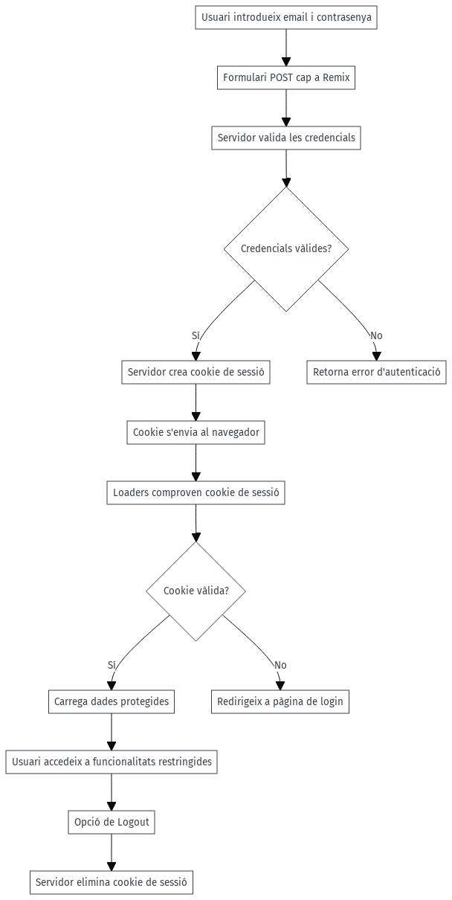
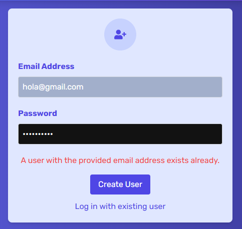

# Com funciona l'autenticació en una WEB-APP?

### **Introducció a l'autenticació en el projecte web**

L'autenticació és el mecanisme que permet **verificar la identitat d'un usuari** abans que aquest accedeixi a recursos o funcionalitats específiques de l'aplicació. En el teu projecte web amb **Remix**, implementarem un sistema d'autenticació basat en **credencials, cookies i sessions**.

---

### **1. Credencials de l'usuari**
- Les **credencials** són normalment:
  - **Email** o **nom d'usuari**.
  - **Contrasenya** (que es valida al servidor).
- Els usuaris introduiran aquestes credencials a través d'un **formulari de login o signup**.

---

### **2. Validació i creació de la sessió**
Quan un usuari envia les credencials:
1. El **servidor** valida les dades rebudes:
   - Comprova si l'email i la contrasenya són correctes (normalment amb una base de dades).
   - La contrasenya mai es guarda en text pla, sinó **hashada** amb una llibreria com **bcrypt**.
2. Si les credencials són vàlides, el servidor:
   - Crea una **sessió** per l'usuari.
   - Retorna una **cookie segura** que identifica l'usuari.

---

### **3. Cookies i Sessió**
- **Cookies**:
   - Una cookie s'envia des del servidor al navegador i es guarda localment.
   - Conté un identificador únic (token de sessió) que permet al servidor reconèixer l'usuari en futures peticions.
   - Es configura com **HTTPOnly** i **Secure** per evitar atacs (com XSS o CSRF).

- **Sessió**:
   - La sessió és una associació entre el **token de sessió** i la informació de l'usuari.
   - Es guarda al servidor (o a una base de dades com Redis) i es valida en cada petició.

---

### **4. Mecanisme amb Remix**
Amb **Remix**, el flux funciona així:
1. **Login**:
   - L'usuari envia les credencials amb un **`Form`** a un `action`.
   - El servidor valida les credencials i crea una cookie de sessió.
2. **Protecció de rutes**:
   - Els `loaders` comproven la cookie de sessió abans de carregar dades.
   - Si la cookie no és vàlida o no existeix, es redirigeix l'usuari a la pàgina de login.
3. **Logout**:
   - L'usuari pot tancar sessió esborrant la cookie del navegador.

---

### **5. Diagrama simplificat**
1. **Usuari introdueix email i contrasenya** → Formulari `POST` a Remix.
2. **Servidor valida credencials** → Si són vàlides, crea una cookie de sessió.
3. **Cookie s'envia al navegador** → S'utilitza per identificar l'usuari en peticions futures.
4. **Carregant dades protegides**:
   - Els `loaders` comproven si la cookie és vàlida.
5. **Logout** → El servidor elimina la cookie de sessió.



---
# Setup del meu projecte per Autenticar

El que volem aconseguir és que només els usuaris autenticats puguin fer ús de l'aplicatiu. 

* Hem de ser capaços de crear usuaris
* Hem de ser capaços de fer login amb aquests usuaris

Anem a generar una taula d'usuari a Supabase (pots investigar com fer-ho amb Prisma i MongoDB si ho prefereixes).

## **Estructura de la base de dades a Supabase**

### **1. Taula `users`**

Crea una taula anomenada **`users`** per guardar les credencials d'usuari:

| Columna   | Tipus           | Propietats                       |
|-----------|-----------------|----------------------------------|
| `id`      | `uuid`          | Primary Key, Default `gen_random_uuid()` |
| `email`   | `text`          | Unique, Not Null                |
| `password`| `text`          | Not Null                        |

#### **SQL per crear la taula `users`:**
```sql
CREATE TABLE users (
  id uuid PRIMARY KEY DEFAULT gen_random_uuid(),
  email text UNIQUE NOT NULL,
  password text NOT NULL
);
```

---

### **2. Taula `expenses`**

Modifica o crea la taula anomenada **`expenses`** per guardar les despeses associades a cada usuari:

| Columna     | Tipus          | Propietats                           |
|-------------|----------------|--------------------------------------|
| `id`        | `uuid`         | Primary Key, Default `gen_random_uuid()` |
| `title`     | `text`         | Not Null                            |
| `amount`    | `float8`       | Not Null                            |
| `date`      | `timestamptz`  | Not Null                            |
| `date_added`| `timestamptz`  | Default `now()`                     |
| `user_id`   | `uuid`         | Foreign Key → `users(id)`           |

#### **SQL per crear la taula `expenses`:**
```sql
CREATE TABLE expenses (
  id uuid PRIMARY KEY DEFAULT gen_random_uuid(),
  title text NOT NULL,
  amount float8 NOT NULL,
  date timestamptz NOT NULL,
  date_added timestamptz DEFAULT now(),
  user_id uuid NOT NULL REFERENCES users(id) ON DELETE CASCADE
);
```

---

### **3. Relacions entre `users` i `expenses`**

- La columna `user_id` a la taula `expenses` és una **Foreign Key** que apunta a la columna `id` de la taula `users`.
- La propietat **`ON DELETE CASCADE`** assegura que si un usuari s'elimina, totes les seves despeses també s'eliminaran.

---

## Afegint Credencials al Servidor

Tenim els nostre `AuthForm` amb un `form` que envia les dades a la ruta on està injectat, `_marketing.auth.tsx`. 

Aquí ens torna a passar que tenim algunes validacions al client (html), poc fiables, i volem també dur a terme validacions a de backend de Remix. 

He modificat l'arxiu `validations.server.ts` per incorporar noves validacions pel cas d'usuaris i credencials. Pot copiar-lo i fer un cop d'ull. 

### **Explicació de les validacions**

#### Validació de despeses (validateExpenseInput):
- **title**: No pot ser buit i ha de tenir com a màxim 30 caràcters.
- **amount**: Ha de ser un número vàlid i major que 0.
- **date**: Ha de ser una data abans d'avui.

#### Validació de credencials (validateCredentials):
- **email**: Ha d'incloure un "@" per ser considerat vàlid.
- **password**: Ha de tenir una longitud mínima de 7 caràcters.

#### Gestió dels errors:
- Les validacions fallen si alguna condició no es compleix.
- Es llancen en forma d'objecte ValidationErrors que pot ser gestionat per mostrar missatges d'error a l'usuari.

---

Vale, ara sí a la lògica de l'`Action` podem començar a fer ús d'aquestes validacions.

```typescript
// _marketing.auth.tsx
// ...
  // Validacions
  try {
    validateCredentials({ email, password });
  } catch (error) {
    return error;
  }
  // ...
```
Recorda que si retornem "data" en un `Action` de Remix, aquesta la podem recuperar a través de `useActionData`. 

I al nostre `AuthForm` podem mostrar els errors que ens retorni el servidor. 

```tsx
// AuthForm.tsx
//..
import { ValidationErrors } from "../../types/validations.server";
//...
function AuthForm() {
  //...
  const validationErrors = useActionData<ValidationErrors>();
  //...
  {validationErrors && (
    <div className="text-red-500 text-sm mt-2">
      {Object.values(validationErrors).map((error) => (
        <div key={error}>{error}</div>
      ))}
    </div>
  )}
  //...
```

Això és com ja havíem fet  l'`ExpenseForm`. Pots provar si funciona canviant a l'inspector del navegador les validacions de `email` o `password` per veure com es mostren els errors.


## Creant un usuari

Començarem afegint un arxiu específic sota la carpeta `/data` per a la gestió d'autenticacions d'usuari. 

Crea un arxiu anomenat `auth.server.ts` i començarem creant la funció `signup` per fer la petició a la base de dades de Supabase per crear un usuari. 

```typescript
// auth.server.ts
import supabase from "../utils/supabaseClient";
import bcrypt from "bcrypt";

const SALT_ROUNDS = 10;

interface SignupInput {
  email: string;
  password: string;
}

export async function signup({ email, password }: SignupInput) {
  // 1. Comprovar si l'usuari ja existeix a la taula 'users'
  const { data: user, error: findError } = await supabase
    .from("users")
    .select("id")
    .eq("email", email)
    .single();
}
```

Podem encara afinar una mica més, tornant un error més precís si l'usuari ja existeix:

```typescript
// auth.server.ts
export async function signup({ email, password }: SignupInput) {
  // 1. Comprovar si l'usuari ja existeix a la taula 'users'
  const { data: existingUser, error: findError } = await supabase
    .from("users")
    .select("id")
    .eq("email", email)
    .single();


  if (existingUser) {
    const error = new Error(
      "A user with the provided email address exists already.",
    );
    (error as any).status = 422; // Afegim status per gestionar-ho després
    throw error;
  }
}
```

Un cop validat que l'usuari no existeix, podem crear-lo però COMPTE! No volem passar la constrasenya en text pla i emmagatzemar-la visible per tothom.

Farem un hash de la contrasenya abans de guardar-la a la base de dades.  Per això podem instal·lar la llibreria `bcrypt`:

```bash
npm install bcrypt
```

Ara ja sí podem crear l'usuari a la base de dades:


```typescript
// auth.server.ts
export async function signup({ email, password }: SignupInput) {
  // 1. Comprovar si l'usuari ja existeix a la taula 'users'
  const { data: existingUser, error: findError } = await supabase
    .from("users")
    .select("id")
    .eq("email", email)
    .single();

    if (existingUser) {
    const error = new Error(
      "A user with the provided email address exists already.",
    );
    (error as any).status = 422; // Afegim status per gestionar-ho després
    throw error;
  }

  // 2. Hash de la contrasenya
  const hashedPassword = await bcrypt.hash(password, SALT_ROUNDS);

  // 3. Inserir el nou usuari a la taula 'users'
  const { data: newUser, error: insertError } = await supabase
    .from("users")
    .insert([{ email, password: hashedPassword }])
    .select("id, email")
    .single();

  if (insertError) {
    throw new Error(`Failed to create user: ${insertError.message}`);
  }

  // 4. Retornar la informació del nou usuari
  return newUser;
}
```

Ara ja tenim la funció `signup` i podem tornar a la nostra lògica de `_marketing.auth.tsx` per cridar-la quan es faci un signup.

```typescript
  // Gestió amb les dades

  if (authMode === "login") {
    // Autenticació (login)
  } else {
    // Creació d'usuari (signup)
    signup({ email, password });
    return redirect("/expenses");
  }
```
Si proves a fer un signup amb un usuari que no existeixi, hauria de crear-se a la base de dades. Prova-ho!

> Nota: Estem creant usuaris de moment, NO sessions ara per ara!

Prova també a mirar d'afegir un usuari que ja existeix. L'`ErrorBoundary` hauria mostrar l'error que li hem passat. Això no fa massa bona la nostra experiència d'usuari. Haver de tornar a la pàgina de login per tornar a introduir les dades, no sembla la millor idea. 

Com ho faries? Pensa-ho... ja hem implementat abans un `useActionData` per mostrar els errors amb la validació. 

Com pots aconseguir això?



## Login d'usuari

Primer crearem una funció per fer el login a `auth.server.ts`:

```typescript
// auth.server.ts
export async function login({ email, password }: SignupInput) {
  // 1. Comprovem si l'usuari existeix
  const { data: existingUser } = await supabase
    .from("users")
    .select("*")
    .eq("email", email)
    .single();

  // Si no existeix, tenim un "problema"
  if (!existingUser) {
    const error = new Error("Could not log in with the provided credentials.");
    (error as any).status = 401; // En el fons és un problema d'autenticació
    throw error;
  }

  // 2. Comprovar la contrasenya
  // Hem de gestionar el hash-password i no podem comparlar-lo directament.
  // Fem servir la funció compare de bcrypt per comparar-los.
  const isPasswordValid = await bcrypt.compare(password, existingUser.password);

  if (!isPasswordValid) {
    const error = new Error("Could not log in with the provided credentials.");
    (error as any).status = 401; // Afegim status per gestionar-ho després
    throw error;
  }
}
```

1. **Comprova si l'usuari existeix a la base de dades**:
   - Fa una consulta a Supabase per cercar un usuari amb l'email proporcionat.
   - Si no existeix, llença un error d'autenticació (`status 401`).

2. **Comprova la contrasenya**:
   - Utilitza `bcrypt.compare` per comparar la contrasenya proporcionada amb el hash desat a la base de dades.
   - Si la contrasenya no és vàlida, llença un error d'autenticació (`status 401`).

---

## Sessió & Cookies

Abans de res, repassem com funcionen les cookies i les sessions. La diferència principal entre **cookies** i **sessions** rau en com s'emmagatzemen i gestionen les dades del costat client i servidor:

## 1. **Cookies**
- **Definició**: Són petits fragments de dades que el servidor envia al navegador del client i aquest guarda localment.
- **Emmagatzematge**: Les dades s’emmagatzemen **al navegador** (costat client).
- **Durada**: Pots configurar-ne l'expiració (ex: dies, hores) o fer-les temporals.
- **Accessibilitat**: Les cookies són accessibles tant pel client (JavaScript) com pel servidor (si no són `httpOnly`).
- **Seguretat**: 
   - Les cookies poden ser vulnerables a **robatori** si no estan protegides adequadament.
   - Opcions com `httpOnly`, `secure`, i `sameSite` milloren la seguretat.
- **Exemple d’ús**:
   - Emmagatzemar preferències d'usuari (tema clar o fosc).
   - Guardar petits identificadors (com un `user_id`).

---

## 2. **Sessions**
- **Definició**: Són dades emmagatzemades **al servidor** que es vinculen a l’usuari mitjançant un identificador únic.
- **Emmagatzematge**: 
   - Al servidor, es guarda la informació real.
   - Al client, només s'envia un identificador de sessió a través d'una **cookie**.
- **Durada**: Les sessions solen tenir una **durada limitada** i expiren automàticament després d’inactivitat.
- **Accessibilitat**: Només el servidor pot accedir a les dades de sessió.
- **Seguretat**: 
   - Les sessions són més segures perquè les dades no viatgen amb cada petició, només l’identificador.
- **Exemple d’ús**:
   - Gestionar inici de sessió d’usuaris (autenticació).
   - Mantenir l’estat d'una compra al carro.

---
## **Exemple Pràctic**

1. **Cookie**:
   - Guardes una cookie amb `theme: "dark"`.
   - Cada vegada que l'usuari visita el lloc, llegeixes aquesta cookie i actives el tema fosc.

2. **Sessió**:
   - Quan un usuari inicia sessió, es crea una sessió al servidor.
   - S’envia una cookie amb l’**ID de sessió** (`session_id: "123456"`).
   - El servidor usa aquest ID per identificar l'usuari i carregar-ne les dades.

---

## **Implementant Sessions amb Remix**

En el cas de Remix per gestionar una sessió necessitem un hook de Remix anomenat `createCookieSessionStorage`. Aquest hook ens permetrà crear una sessió amb una cookie segura.

```typescript
import { createCookieSessionStorage } from "@remix-run/node";

// Crear l'emmagatzematge de sessió amb configuració de la cookie
export const { getSession, commitSession, destroySession } =
  createCookieSessionStorage({
    cookie: {
      // 1. name: Nom de la cookie que s'emmagatzemarà al navegador del client.
      // Exemple: "session"
      name: "session",

      // 2. secrets: Clau secreta utilitzada per signar i validar les cookies.
      // Es fa servir per assegurar la integritat i evitar manipulacions.
      // Pots afegir múltiples claus per a la rotació de secrets.
      secrets: ["my_secret_key"],

      // 3. sameSite: Política SameSite per protegir contra atacs CSRF.
      // - "lax": La cookie només s'envia en peticions de mateix origen o navegació parcial.
      // - "strict": La cookie no s'envia amb peticions entre orígens.
      // - "none": La cookie s'envia en totes les peticions (requereix `secure`).
      sameSite: "lax",

      // 4. path: La ruta del domini on la cookie és accessible.
      // "/" indica que és accessible a totes les rutes del domini.
      path: "/",

      // 5. httpOnly: Fa que la cookie només sigui accessible des del servidor.
      // Evita que JavaScript del client accedeixi a la cookie (millora la seguretat).
      httpOnly: true,

      // 6. secure: Indica si la cookie només s'ha d'enviar en connexions HTTPS.
      // Millora la seguretat i s'hauria d'habilitar en producció.
      // Aquí s'utilitza `process.env.NODE_ENV === "production"` per activar-ho només en prod.
      secure: process.env.NODE_ENV === "production",
    },
  });

```

Per tant, al nostre `auth.server.ts` podem fer servir aquesta funció per crear una sessió quan l'usuari faci login:

```typescript
// auth.server.ts

//...

// Obtenim el secret de la sessió de les variables d'entorn (.env)
const SESSION_SECRET = process.env.SESSION_SECRET;

// Creem una nova instància de CookieSessionStorage
const sessionStorage = createCookieSessionStorage({
  cookie: {
    secure: process.env.NODE_ENV === "production", // Només HTTPS en desenvolupament
    secrets: [SESSION_SECRET], // Array de secrets per a signar les cookies
    name: "supabaseSession", // Nom de la cookie
    sameSite: "lax", // Protecció contra CSRF
    maxAge: 30 * 24 * 60 * 60, // 30 dies
    httpOnly: true, // No accessible via JavaScript
  },
});
//...
```

Recorda afegir el secret de la sessió a les variables d'entorn del teu projecte (`.env`). De moment, pots posar un valor aleatori com a clau secreta.

```bash
SESSION_SECRET=super_secret_key
```
## Creant una cookie de sessió

Un cop tenim la sessió creada, podem "demanar" una sessió amb `getSession`:

```typescript
async function createUserSession(userId: string, redirectPath: string) {
  // Obtenir la sessió actual o crear-ne una nova
  const session = await sessionStorage.getSession();

  // Estableix l'identificador d'usuari dins de la sessió
  session.set("userId", userId);

  // Retorna una redirecció a la ruta especificada amb la sessió a les capçaleres
  return redirect(redirectPath, {
    headers: {
      "Set-Cookie": await sessionStorage.commitSession(session), // Guarda i retorna la cookie
    },
  });
}
```

### On ho fem servir ara? Doncs quan l'usuari fa login, és clar!

Al final de la funció `login` de `auth.server.ts`, crida la funció `createUserSession` per crear una sessió amb l'`id` de l'usuari:

```typescript
// auth.server.ts
//...
export async function login...
//...

// 3. Crear la sessió de l'usuari
  return createUserSession(existingUser.id, "/expenses"); // Redirecció a la pàgina d'Expenses
```

I allà on gestionem la lògica d'autenticació, a `_marketing.auth.tsx`, crida la funció `login`:

```typescript
// _marketing.auth.tsx
//...
// Gestió amb les dades
  try {
    if (authMode === "login") {
      // Autenticació (login)
      return await login({ email, password });
    } else {
      // Creació d'usuari (signup)
      await signup({ email, password });
      return redirect("/expenses");
    }
  } catch (error) {
    if (error.status === 422) {
      // retornem 'Data' a l'Action per tal que ho pugui mostrar també com abans amb la Validació.
      return { credentials: error.message };
    }
  }
  //...
```
Fixa't que hem de retornar la funció de login perquè necessitem que aquesta `Acció` retorni aquesta redirecció i a més de configurar correctament les cookies anirem directament a la pàgina d'`Expenses`. 

Això haurà de ser el mateix amb el signup, per tant podrem treure el `redirect` de dins del `else` i fer que ho faci directament a través de les credencials. Podem logejar l'usuari immediatament després de crear-lo no?

```typescript
// auth.server.ts
//...
  // 4. Retornar la informació del nou usuari
  //return newUser;
  return createUserSession(newUser.id, "/expenses");
  //...
```
Temps de comprovar-ho i veure a 'DevTools' si tenim la cookie de sessió creada.

Si tot ha anat bé, podrem fer ús d'aquesta 'cookie' per identificar l'usuari a l'hora de fer les peticions.


